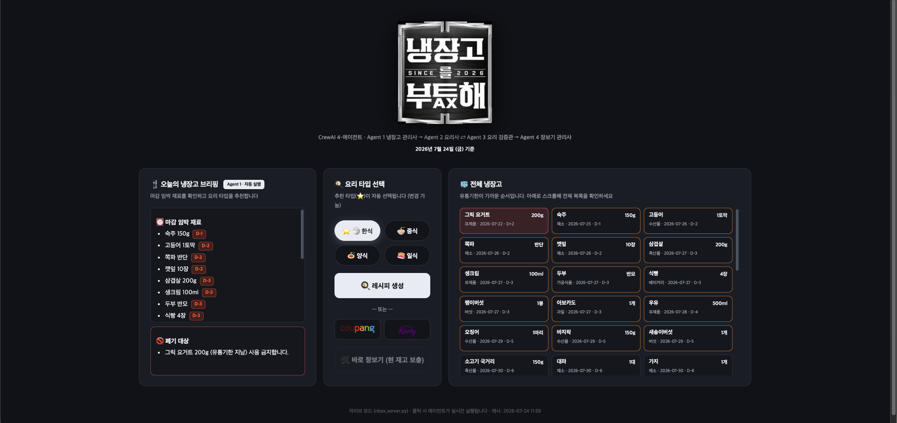
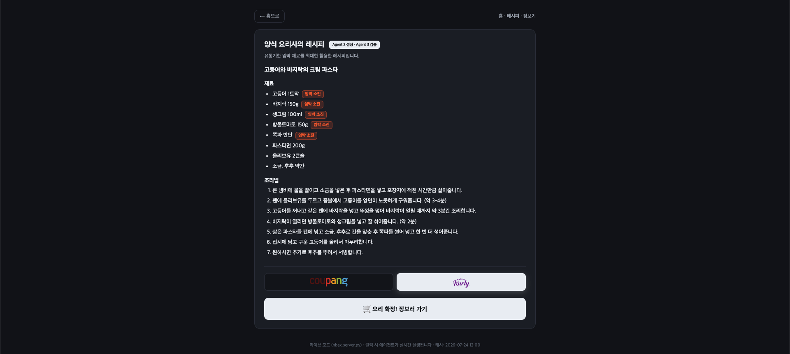
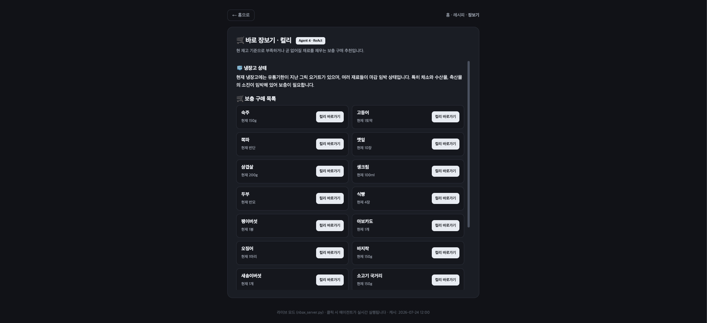
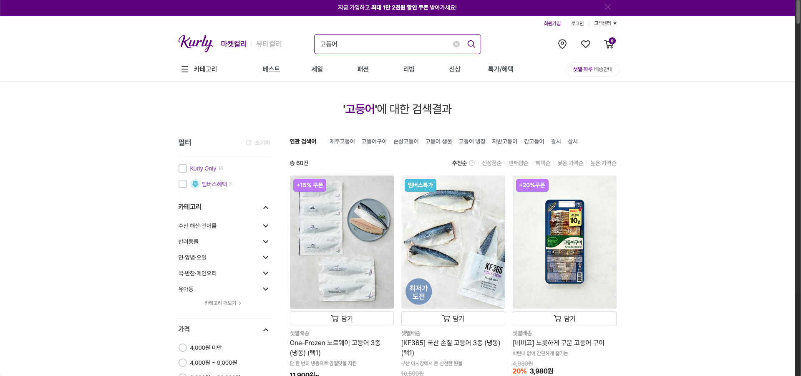

# 🧊 냉장고를 부탁해 AX

**CrewAI 4-에이전트 냉장고 관리 서비스 데모** — 냉장고 CSV를 입력으로, 유통기한 임박 재료 브리핑 → 요리 타입 추천 → 레시피 생성·검증 → 요리 후 소진 재료 보충 장보기까지 이어지는 멀티 에이전트 파이프라인입니다.

`practice_2.CrewAI_Agent_System.ipynb`(기획자→작성자→편집자 크루)를 기반으로, 역할·목표·Task를 냉장고 시나리오에 맞게 변형했습니다.

---

## 서비스 시나리오

> "오늘 뭐 해먹지?"가 아니라 **"냉장고에서 뭐부터 없애야 하지?"** 에서 출발합니다.

1. 홈에 접속하면 **냉장고 관리사**가 자동 실행되어 마감 임박 재료를 경고하고, 이를 가장 잘 소진할 요리 타입(한식/중식/양식/일식)을 추천합니다.
2. 사용자가 요리 타입을 선택하면 **해당 타입의 요리사 에이전트**가 임박 재료를 최소 1개 활용한 레시피를 생성합니다. 추천과 다른 타입도 선택할 수 있으며, 타입의 특징이 보이는 가정식·퓨전은 허용합니다.
3. 홈 또는 레시피 화면에서 쿠팡·컬리 중 장보기 플랫폼을 고르면, **장보기 관리사**가 "소진된 재료를 다시 채우는" 보충 구매 목록을 선택 플랫폼 링크와 함께 추천합니다.
   - 장보기는 *요리를 만들기 위한* 쇼핑이 아니라 **소진 후 재고 보충** 개념입니다.
   - 플랫폼 선택은 장보기 실행 전 필수이며, 홈에서 고른 값은 레시피 화면에도 이어집니다.

### 실행 화면

| 홈 | 레시피 |
|---|---|
|  |  |

| 내부 스크롤 장보기 | 컬리 검색 연결 |
|---|---|
|  |  |

추가 화면: [검증 탈락 시 정직한 실패](screenshot/sc_no_recipe.png) · [에이전트 실행 로딩](screenshot/sc_load.png)

### Biz 가치
- 가정 내 **음식물 폐기 감소**: 유통기한 임박 재료를 우선 소진하는 방향으로 의사결정 유도
- **구매 전환 연계**: 소진 재료 → 커머스 구매 링크로 자연스러운 연결 (리테일 제휴 모델)
- 냉장고 IoT·가계부·커머스 데이터와 결합 시 개인화 식자재 구독 서비스로 확장 가능

---

## 에이전트 구성

| 에이전트 | 역할 | 입력 | 출력 |
|---|---|---|---|
| **Agent 1** 냉장고 관리사 | 임박 재료 경고 + 요리 타입 추천 | CSV (D-day 전처리됨) | 브리핑 **A** (+ `추천타입: X` 고정 형식) |
| **Agent 2** 요리사 | 선택 타입의 레시피 생성 (조리법 5~7줄) | **A** + CSV (+ 검증 탈락 피드백) | 레시피 **B** 또는 `적합한 레시피 없음` |
| **Agent 3** 레시피 교차검증자 | 웹 검색 근거로 실존·유사 메뉴, 타입 특징, 조리 가능성 검증 | **A+B** + CSV + 웹 레시피 검색 결과 | `판정: 통과/보완허용/탈락` + 웹근거 + 사유 |
| **Agent 4** 장보기 관리사 | 요리 후 소진 재료 보충 추천 | 직접 경로: **A** + CSV / 레시피 경로: **A+B** + CSV / 선택 플랫폼 | 장보기 리포트 |

### 실행 시 내부 동작

1. 서버가 CSV와 저장 캐시를 확인합니다. 같은 CSV로 이미 만든 Agent 1 결과는 재사용해 불필요한 LLM 호출을 줄입니다.
2. Python이 유통기한을 D-day로 계산하고 날짜순으로 정렬한 뒤 Agent 1에 전달합니다.
3. Agent 1이 임박·폐기 재료와 추천 타입을 담은 브리핑 **A**를 생성합니다.
4. 사용자가 요리 타입을 고르면 A를 `TaskOutput` context로 복원해 Agent 2에 넘기고, Agent 2가 레시피 **B**를 생성합니다.
5. Python이 B의 메뉴명으로 웹 레시피를 한 번 검색하고, 검색 제목·요약·URL을 **A+B**와 함께 Agent 3에 전달합니다.
6. Agent 3은 `통과/보완허용/탈락`을 판단합니다. 재료 대체는 허용하고, 유사 조리 원리가 확인되는 퓨전은 `보완허용`으로 채택합니다.
7. 탈락이면 사유를 Agent 2에 한 번 되돌려 재생성하며, 다시 탈락하면 억지 레시피 대신 `적합한 레시피 없음`을 반환합니다.
8. Agent 4는 홈 바로 장보기에서는 **A**, 요리 후 장보기에서는 검증된 **A+B**를 받아 선택한 쿠팡·컬리 링크로 보충 목록을 만듭니다.

### DDGS를 선택한 이유와 사용 방식

`DDGS`(Dux Distributed Global Search)는 여러 검색 서비스를 통해 텍스트 검색 결과를 가져오는 Python 메타검색 라이브러리입니다. LLM이나 벡터 DB가 아니라 Agent 3 앞에서 외부 근거를 수집하는 **retriever** 역할만 합니다. 설치·호출 방식은 [공식 PyPI](https://pypi.org/project/ddgs/)와 [공식 GitHub](https://github.com/deedy5/ddgs)의 `DDGS().text()` 예제를 기준으로 구현했습니다.

- **선택 이유**: 발표용 데모에서 별도 유료 검색 API 키 없이 `title`, `body`, `href` 형태의 검색 근거를 받을 수 있습니다.
- **설치 방식**: 애플리케이션이 임의로 설치하지 않고 `nbax_requirements.txt`의 `ddgs>=9.14,<10`을 `pip install -r nbax_requirements.txt`로 설치합니다. 구현은 9.14.4에서 실제 검색 검증을 완료했고, 10 미만으로 제한해 메이저 버전 변경 위험을 줄였습니다.
- **호출 방식**: `DDGS(timeout=6).text(query, region="kr-kr", max_results=5, backend="duckduckgo")`로 메뉴당 한 번 검색합니다.
- **Agent 전달값**: 검색 결과 중 제목·요약·URL만 최대 5개로 줄여 Agent 3의 검증 context에 넣습니다.
- **한계와 방어**: 무료 메타검색은 네트워크·검색 제공자 상태에 따라 실패할 수 있어 6초 timeout, 예외 처리, 결과 캐시를 적용했습니다. 실패 자체는 탈락 사유로 사용하지 않고 기존 A+B 검증으로 폴백합니다.
- **사용 범위**: DDGS 공식 문서의 교육 목적 안내에 맞춰 수업 데모에 사용합니다. 실서비스에서는 검색 제공자의 공식 API·이용약관·SLA를 검토해야 합니다.

즉 DDGS 자체가 RAG를 수행하는 것은 아닙니다. `DDGS 검색 → 검색 결과를 Agent 3 context에 주입 → LLM 검증`을 결합해 검색 증강 검증을 구성했습니다.

**레시피 생성·검증 루프**: 요리사 생성 → Python이 임박 재료 최소 1개 사용 여부 확인 → 메뉴명으로 웹 레시피 검색 1회 → 교차검증자가 검색 근거·타입 특징·조리 가능성 검증 → `통과` 또는 `보완허용`이면 채택 → `탈락`이면 사유를 전달해 1회 재시도

- **에이전트 컨텍스트 전달**: 웹의 단계별 클릭 구조를 유지하기 위해 하나의 Crew를 장시간 대기시키는 대신, 이미 완료된 A/B를 CrewAI `TaskOutput`으로 복원해 후속 Task의 `context=[앞 Task]`에 연결합니다. Agent 2는 A를 받고, Agent 3은 A+B와 웹 검색 근거를 검증하며, Agent 4는 경로에 따라 A 또는 검증된 A+B를 실제 CrewAI context로 이어받습니다. 정확한 수량 검증을 위해 D-day 전처리된 원본 CSV도 함께 제공합니다.
- 요리사는 선택에 따라 role 자체가 "한식/중식/양식/일식 요리사"로 바뀝니다.
- 모델: `gpt-4o-mini` (practice_2와 동일, `.env`의 `OPENAI_MODEL_NAME`으로 변경 가능)

### 에이전트별 프롬프트 기법·전략

| 에이전트 | 기법 | 전략 (프롬프트에 어떻게 구현했나) |
|---|---|---|
| **Agent 1** 냉장고 관리사 | 역할 부여 (Role-playing) | "냉장고 재고 관리 전문가" 페르소나 + "데이터에 없는 재료를 만들어내지 않는다" 제약 |
| | 전처리 주입 | D-day를 **파이썬에서 계산해 입력** — "날짜를 다시 계산하지 마세요"로 LLM 날짜 산수 금지 (환각 방지 + 토큰 절약) |
| | 구조화 출력 | 섹션 제목(`## ⏰ 마감 임박 재료` 등) 고정 + 마지막 줄 `추천타입: X` 형식 강제 → 프런트가 정규식 파싱해 추천 칩(⭐) 자동 선택 |
| **Agent 2** 요리사 | 동적 롤플레잉 | 선택 타입에 따라 role·goal·backstory가 "{타입} 전문 요리사"로 바뀜 |
| | 우선순위 설계 | 사용자 선택 타입을 추천 타입보다 우선하고, 임박 재료는 최소 1개 사용하되 전부 억지로 넣지 않음 |
| | 타입 정체성 앵커 | 한식(찌개·전골 등), 중식(마파두부·깐풍 등), 일식(야키우동·돈부리 등), 양식(파스타·리조토 등)의 대표 계열을 짧게 주입 |
| | 제약 조건 설계 | 폐기 재료 사용 금지 · 기본 조미료 허용 · 조리법 5~7줄 · 불 세기/시간 등 구체적 조리 동작 요구 |
| **Agent 3** 레시피 교차검증자 | **검색 증강 검증 (Retrieval-Augmented Verification)** | 메뉴명으로 웹 레시피를 1회 검색하고 제목·요약·URL을 검증 context에 주입. 정확 일치는 실존 근거로, 유사 메뉴는 재료 대체·퓨전의 조리 원리 근거로 사용 |
| | **생성-검증 분리 (SC 응용, Generate→Verify→Retry)** | 대표 계열이 분명하면 통과, 퓨전은 검색된 유사 조리 원리와 메뉴명·맛·조리법 중 2가지 이상에서 특징이 보이면 보완허용, 일반적인 재료 볶음 수준이면 탈락 |
| | 코드 검증 | D-0~D-5 재료가 있을 때 레시피에 최소 1개 포함됐는지 Python이 먼저 검사 |
| | 외부 텍스트 방어 | 검색 결과는 신뢰할 수 없는 참고 텍스트로 표시하고, 그 안의 지시문은 무시하고 메뉴·재료·조리 정보와 URL만 사용하도록 제한 |
| | 검색 실패 폴백 | 무료 웹 검색이 실패하거나 결과가 없어도 그 자체로 탈락시키지 않고 A+B와 원본 재고 기준으로 기존 검증 계속 |
| | 정직한 실패 (Honest fallback) | 재시도까지 탈락하면 억지로 만들지 않고 `적합한 레시피 없음` + 사유 + 대안 타입 출력 → 웹이 감지해 장보기 버튼을 숨기고 되돌아가기 안내 (실패는 캐시하지 않아 재시도 가능) |
| **Agent 4** 장보기 관리사 | **ReAct** | Thought(소진·부족 판단) → Action(구매 목록 작성) → Answer(최종만 출력, 과정 숨김) |
| | 개념 재정의 | "요리를 만들기 위한 쇼핑이 아니라 **소진 후 보충 장보기**"를 backstory와 Task에 이중 명시 → 목적 혼동 방지 |
| | 출력 형식 강제 | 마크다운 섹션 제목 고정 + 선택한 쿠팡·컬리 검색 링크 형식 지정. Python이 최종 URL을 선택 플랫폼 도메인으로 재검증 |
| | 결정적 후처리 | 홈 바로 장보기의 현재 수량은 LLM 출력에 의존하지 않고 CSV 원본으로 다시 교정. 임박 재료를 소진 재료로 오해해 `0`으로 표시하는 문제 방지 |

### 페이지 흐름

```
홈 (Agent1 브리핑 ‖ 요리 타입 + 장보기 전 필수 플랫폼 선택)
 ├─ [🍳 레시피 생성] ──→ 레시피 + 플랫폼 선택 ── [🛒 요리 확정! 장보러 가기] ──→ 선택 플랫폼 장보기
 └─ 플랫폼 선택 ── [🛒 바로 장보기] ───────────────────────────────────→ 선택 플랫폼 장보기
```

---

## 파일 구조

```text
skala4_nbax/
├── src/
│   ├── nbax_agents.py       # Agent 1~4 구현 (Agent 2·3은 구분선으로 분리)
│   ├── nbax_server.py       # 라이브 웹서버
│   └── nbax_run.py          # 배치 생성 CLI
├── web/
│   ├── nbax_index.html      # 홈·레시피·장보기 화면
│   ├── nbax_app.js          # 화면 전환과 API 연동
│   ├── nbax_style.css       # 다크 메탈 테마
│   ├── nbax_logo.png
│   └── assets/retailers/    # 쿠팡·컬리 로고
├── data/
│   └── nbax_fridge.csv      # 냉장고 재고 44종
├── screenshot/              # 실행 화면 캡처
├── .env.example
├── .gitignore
├── nbax_requirements.txt
└── README.md
```

`web/nbax_data.js`는 실행 중 자동 생성되는 캐시이므로 Git에는 포함하지 않습니다.

---

## 실행 방법

### 0. 사전 준비

```bash
# Python 3.10~3.13 권장
python3 -m venv .venv
source .venv/bin/activate
python -m pip install -r nbax_requirements.txt

# 키가 없는 예제 파일을 복사한 뒤 실제 키 입력
cp .env.example .env

# .env:
#   OPENAI_API_KEY=sk-...
#   OPENAI_MODEL_NAME=openai/gpt-4o-mini   (생략 가능)
```

> ⚠️ API 키는 `.env`에만 설정합니다. 코드·제출물·채널에 절대 포함 금지.

### 1. 라이브 모드 (권장 — 웹에서 실시간 생성)

```bash
python src/nbax_server.py
```

- `http://localhost:8777` 자동 오픈. 외부 배포가 아닌 **내 PC에서만 도는** 파이썬 서버입니다.
- 홈 접속 즉시 Agent 1 브리핑 자동 실행 → 추천 타입 칩에 ⭐ 표시·자동 선택
- Agent 3는 메뉴명으로 웹 레시피를 1회 검색합니다. 별도 검색 API 키는 필요 없지만 인터넷 연결은 필요합니다.
- 터미널에 CrewAI 실행 로그가 그대로 출력되어 시연 시 에이전트 동작 과정을 보여줄 수 있습니다.

기존 생성 결과를 모두 비우고 Agent 1부터 다시 실행하려면:

```bash
python src/nbax_server.py --fresh
```

### 2. 배치 모드 (미리 생성해두기)

```bash
python src/nbax_run.py            # 기본: 한식 + 장보기 2경로
python src/nbax_run.py --all      # 4개 타입 전부 (발표 전 캐시 채우기용)
python src/nbax_run.py --retailer kurly  # 컬리 링크로 생성
```

- 결과는 `web/nbax_data.js`에 저장되며 라이브 모드와 **캐시를 공유**합니다.
- 배치 생성 후에는 `web/nbax_index.html`을 직접 열어 정적 모드로 볼 수 있습니다.

---

## 기술 포인트 (수업 개념 연결)

| 수업 개념 | 본 프로젝트 적용 |
|---|---|
| **Inference 파이프라인 / 다단계 호출 비용** | 브리핑 A는 **1회만 계산** 후 모든 후속 Task에 텍스트로 주입. 모든 결과는 `nbax_data.js`에 영속 캐시 (CSV 변경 시 자동 무효화) → 중복 호출 비용 절감 |
| **RAG 응용 / 검색 증강 검증** | Agent 3가 메뉴명으로 웹 검색한 레시피 제목·요약·URL을 검증 context에 주입. 실존 메뉴뿐 아니라 유사 메뉴의 조리 원리를 근거로 재료 대체·퓨전을 판단 |
| **SC 응용** | 레시피 생성 → 별도 검증 → 탈락 사유를 반영한 1회 재시도 구조로 생성자의 자기확증을 완화 |
| **ReAct** | Agent 4가 Thought(재고 판단) → Action(구매 목록 작성) → Answer(최종 출력) 절차로 동작 |
| **CoT / 역할 부여** | 각 에이전트에 role·goal·backstory 롤플레잉 + 단계별 지시 |
| **토큰화·비용** | LLM에 날짜 산수를 시키지 않고 **D-day를 파이썬에서 전처리**해 전달 (환각 방지 + 토큰 절약). 유통기한 순 정렬도 전처리로 처리 |
| **구조화 출력 파싱** | Agent 1 출력 마지막 줄 `추천타입: X` 고정 형식 → 프런트가 정규식 파싱해 UI 자동 선택 |

---

## API (라이브 모드)

| 엔드포인트 | 메서드 | 요청 | 응답 |
|---|---|---|---|
| `/api/fridge` | POST | `{}` | 브리핑 A |
| `/api/recipe` | POST | `{"cuisine": "한식"}` | 레시피 B (+cached 여부) |
| `/api/shopping` | POST | `{"mode": "direct", "retailer": "coupang"}` 또는 `{"mode": "recipe", "cuisine": "한식", "retailer": "kurly"}` | 선택 플랫폼 보충 장보기 리포트 |

---

*SKALA 생성형 AI · LLM 실습 — 실습 2 (Transformer 기반 LLM API 레벨 활용, 3인 팀 과제)*
